# SuperCalculator - All in one Calculator

SuperCalculator is a collection of 20 different mathematics calculators performing specific Calculations, which was Just made using HTML, CSS and Pure Javascript without any framework or library.

This Project is Best for the beginners who want to learn Javascript projects without any frameworks or libraries. This is a simple calculator functionality achieved using Javascript. The logic is very simple with the minimum lines of code possible.

# Available Calculators:

## Homepage

Homepage consists of all 21 Calculator Stacked in single page with links to the indivisual pages of the calculator. Its fully responsive and its is index.html of the main page.

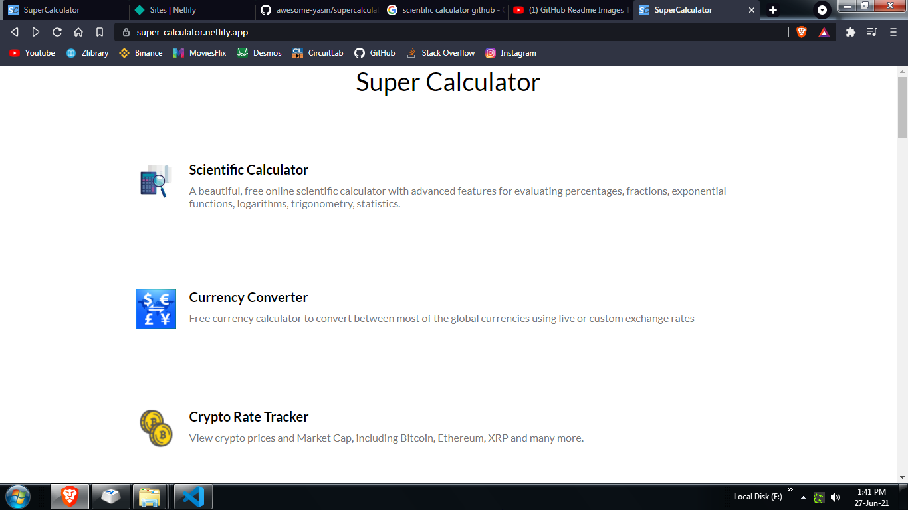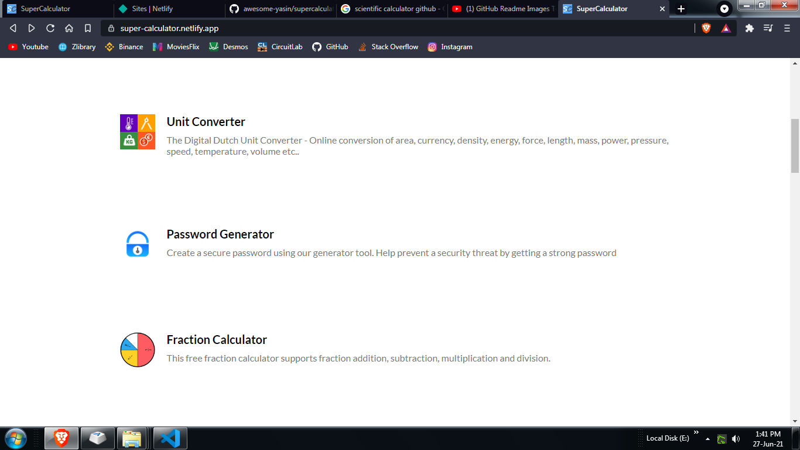

### demo: https://super-calculator.netlify.app/

## 1. Scientific Calculator

The Scientific Calculator Consists of simple functions like addition, substraction,multiplication, division and trignometric functions like sin, cos, tan and complex function like percentage, factorial, log, e, root, radian, degree.

It also contain History tab which consists of calculation history and constant Tabs containing Planks constant, golden Ratio, Ramanunjan Soldner Constants etc...

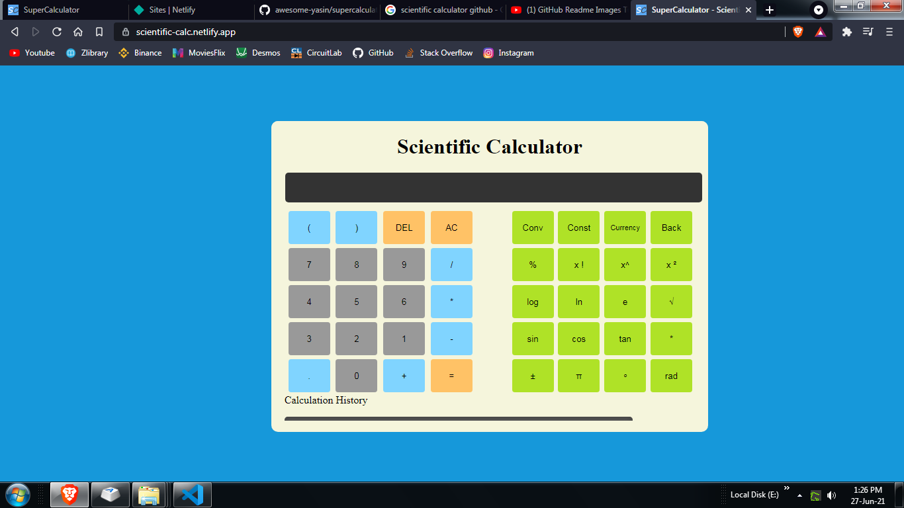

### Demo: https://scientific-calc.netlify.app/

## 2. Currency Converter

The currency converter consists of Currency conversion from Dollar to INR, Pound, RUB, JPY, CAD etc. The converter consist of clean and Responsive UI. 

The API is used from api.exchangeratesapi.io, its a free version API with 1000 API calls, so if it will not work after some use then copy the code and sign up at exchangeratesapi to get you free api key and paste in main.js file to use it smoothly.

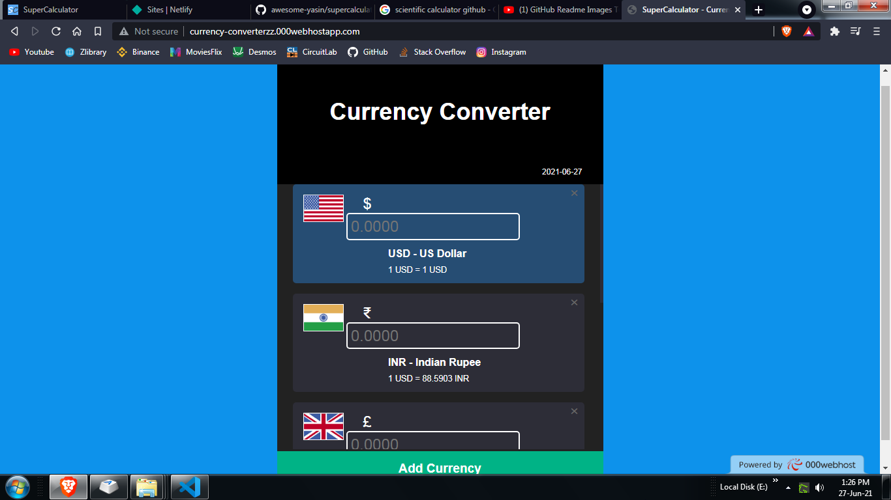

### Demo: http://currency-converterzz.000webhostapp.com/

## 3. Live Crypto Rate Tracker

Live Crypto Rate tracker consists of Crypto rates from different currencies. The initial crypto currencies available are BTC, ETH, DOGE, ADA, YFI, XRP, USDT, DOT etc paired with INR. It also consists of price change in 24 Hrs and volume of circulation supply available

You choose more crypto currencies and Fiet pairs by tapping on curriencies. The API used is from currencytoday.

Some of Stock companies is also available that are my fav stocks from trading view. You can Change or remove it from main folder if required.

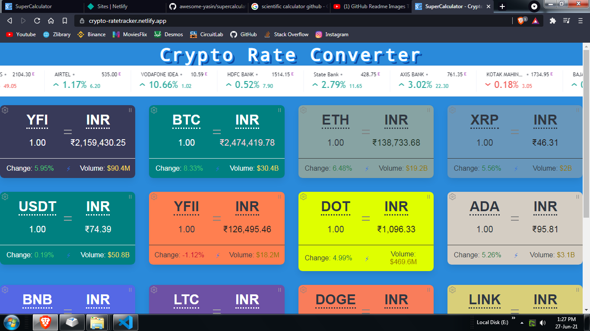

### Demo: https://crypto-ratetracker.netlify.app/

## 4. Unit Conversion

Convert Units like Accelaration, Area, Length, Power, Torque, Volume, Density, Pressure, Temperature etc. Its simple and responsive with lots of Units ans sub Units Available.

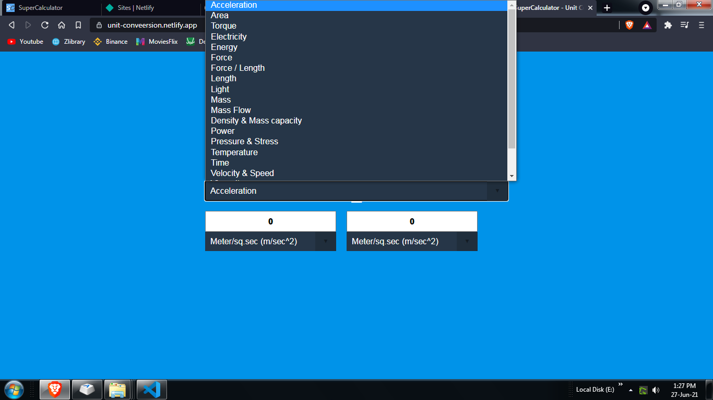

### Demo: https://unit-conveersion.netlify.app/

# 5. Password Generator and Checker

Generate Strong password from 4 to 32 characters consisting of combination of Uppercase, lowercase, numbers, special characters. The UI is Clean and responsive.

You can also Check your password Strongness and how much time will it take to crack your password.

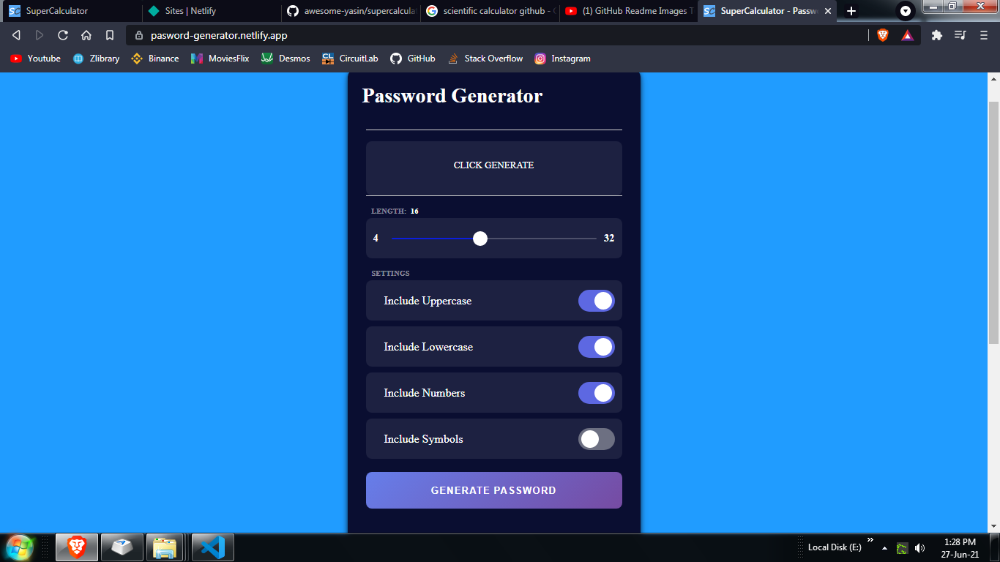     

#### Note: None of your Password is stored. Its Just frontend means all things get executed in Your System.

### Demo: https://pasword-generator.netlify.app/

## 6. Fraction Calculator

Use this calculator to do operation regarding fraction like addition, substraction, multiplication and division of fractions with n no of fraction variable.

Initially it has 2 fractions but you can add n no of fraction to perform operation.

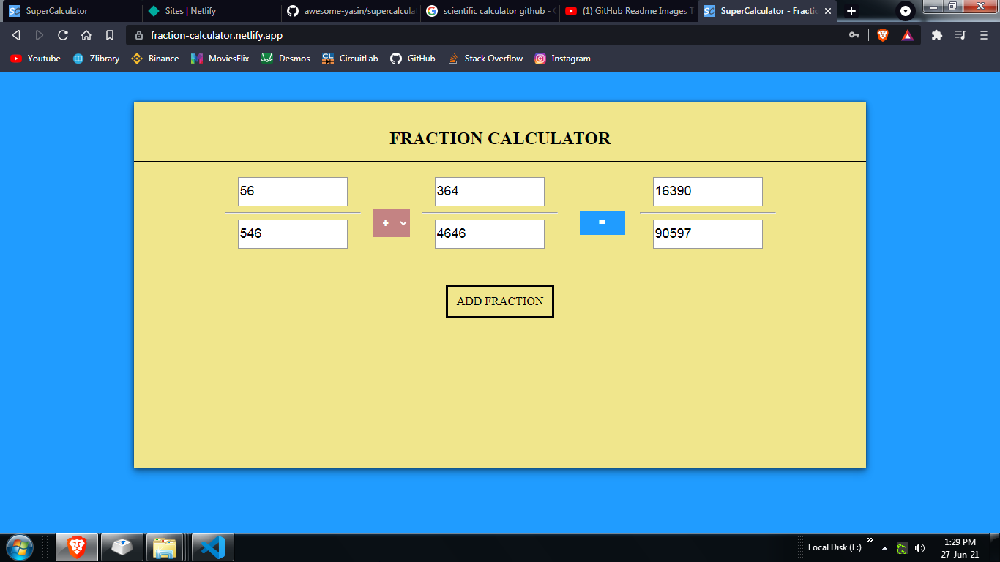

### Demo: https://fraction-calculator.netlify.app/

## 7.Statistics Calculator

Stastics Claculator consisits of operation like finding Sum, Sum of Squares, Mean, Population Variance (σ^2), Population Standard Deviation (σ), Sample Variance (s^2), Sample Standard Deviation (s), Geometric Mean, Quadratic Mean, Median, Mode, Range, First Quartile, Third Quartile, Interquartile Range, Mid-Range, Sorting in assending and decendind order, Minimum, Maximum.

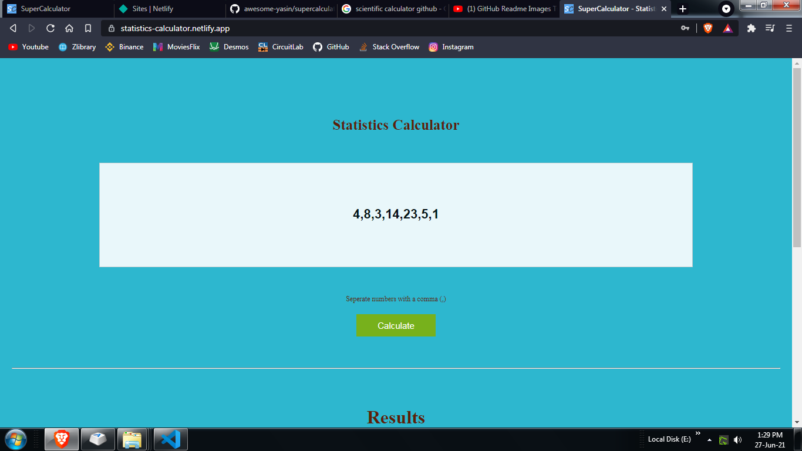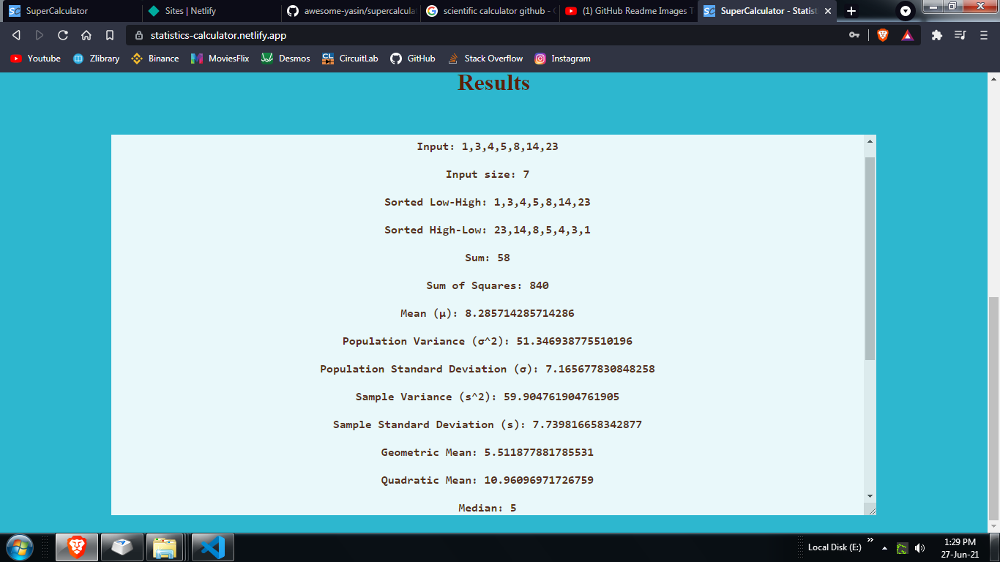

### Demo: https://statistics-calculator.netlify.app/

## 8. QR Code Scanner and Creator

Read QR code and create QR code including text, URL, ISBN, phone number, sms, contact, calendar, email, location.

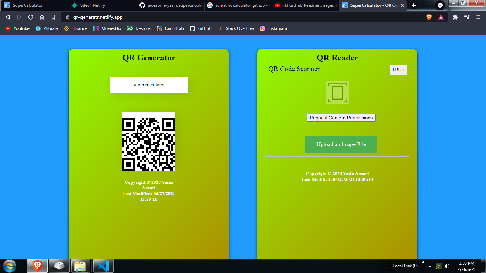

### Demo: https://qr-generatr.netlify.app/

## 9. Quadratic Equation Solver

This online calculator is a quadratic equation solver that will solve a second-order polynomial equation such as ax2 + bx + c = 0 for x, where a ≠ 0, using the quadratic formula.

The calculator solution will show work using the quadratic formula to solve the entered equation for real and complex roots. Calculator determines whether the discriminant (b^2−4ac) is less than, greater than or equal to 0.

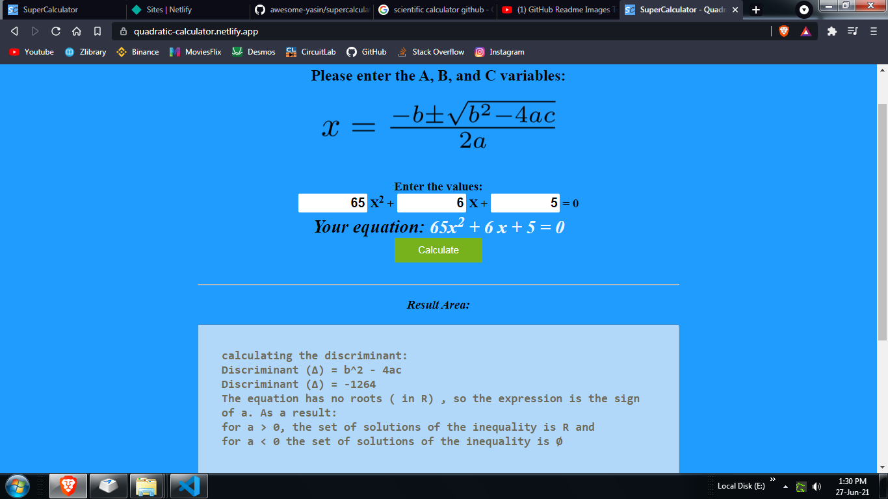

### Demo: https://quadratic-calculator.netlify.app/

## 10. Loan Calculator

Calculate Loan by entering Principal, Rate of Intrest and Time in months with Detailed Monthly Payment Table. It will give output of Total Payment with Detailed Monthly payment and monthly intrest.

It has Clear UI and Totally responsive Input and output Table with Logics Given in Pure Javascript.

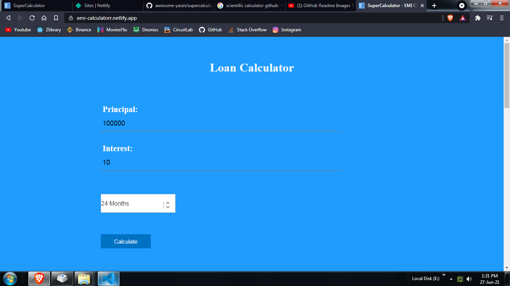 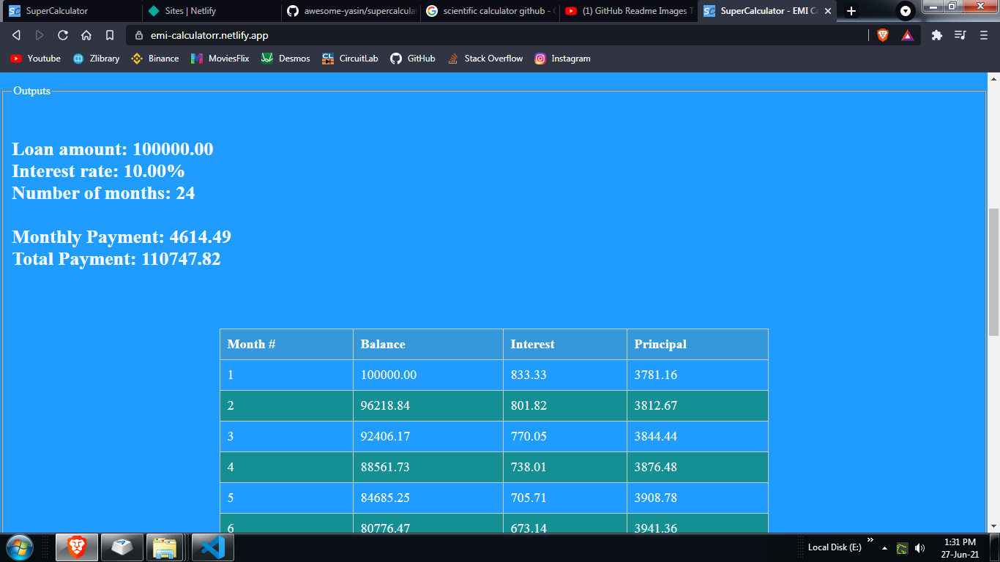

### Demo: https://emi-calculatorr.netlify.app/

## 11. Mortage/Home Loan Calculator

This is another Loan Calculator with aditional functionality of calculating Loan and Home load with aditional taxes included like annual Tax and annual insurance.

It contain more beautifual UI than Previous one with fully responsive and sliders input for better user experience.

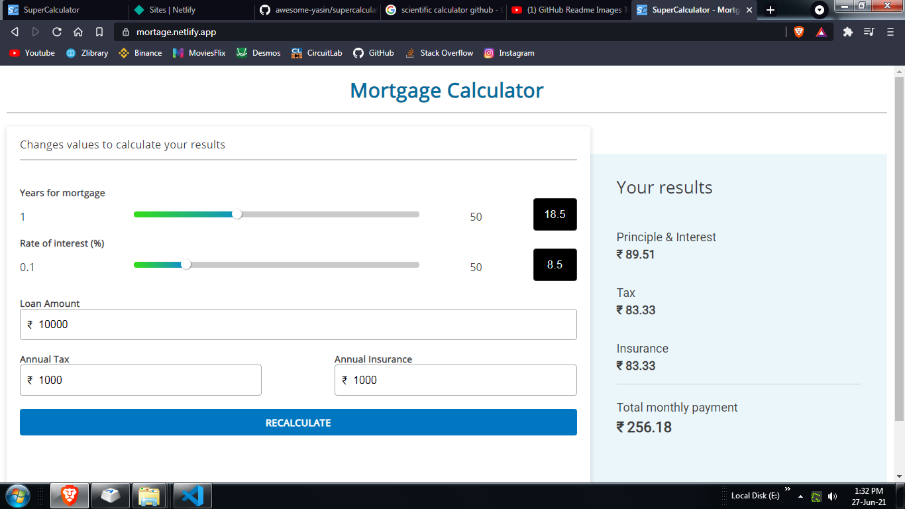

### Demo: https://mortage.netlify.app/
                                                                                                                                                                                                                                  
## 12. Matrix Calculator

Calculate the Matrix, Determinant and Adjacent of a given input using this calculator. Find the addition, substraction and multiplication of tow matrix A and B into Resultant section R.

Swap matrix A with B or R and vice versa also find adjacent, inverse and determinant of Matrix easily.

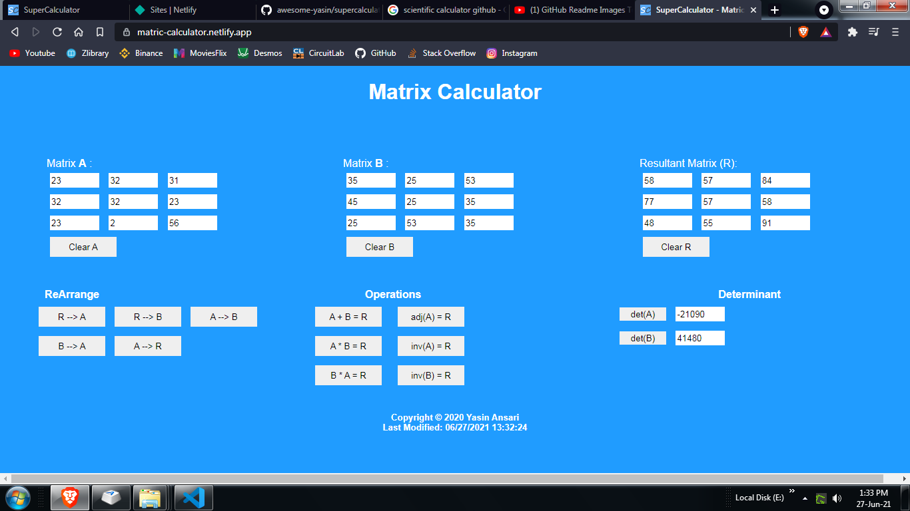

### Demo: https://matric-calculator.netlify.app/

## 13. Binary Calculator

Perform Addition, substraction, Multiplication, Devision of Binary/Decimal/Octal/HexaDecimal simultaniously. You can also convert Binary, decimal, octal, Hexal into any of the given format using its converter. Text to ASCII conversion is also available with awesome UI.

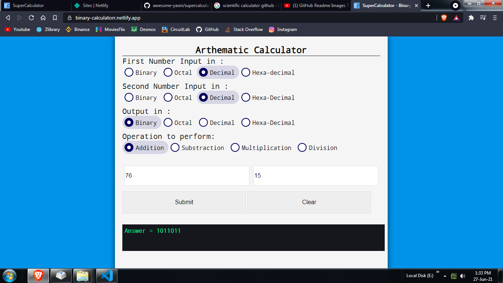 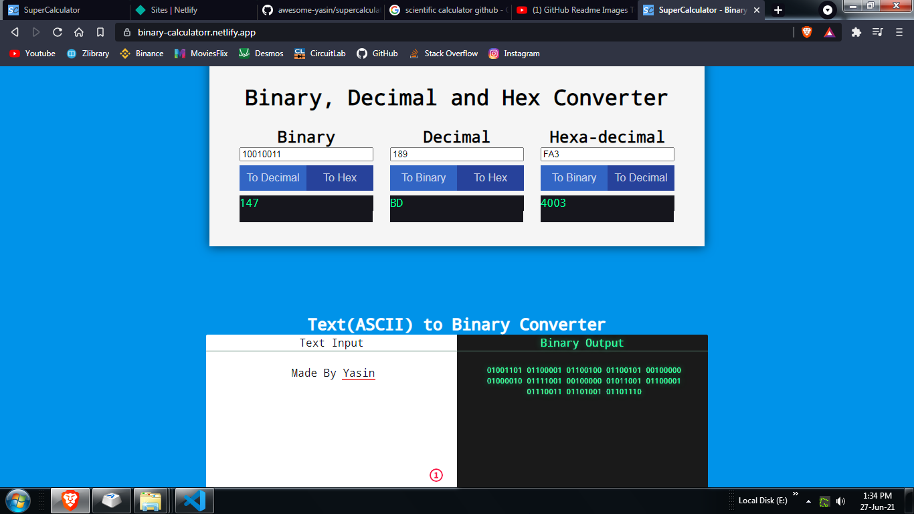

### Demo: https://binary-calculatorr.netlify.app/

## 14.Age Calculator

Calculate your age in month, days, hours even in seconds by inputing date. Also calculate your next birthday from today in Days.

With my age calculator, you can find out how many years, months, weeks, days and hours have passed since you were born. 

### Demo: https://age-calculatorr.netlify.app/

## 15. Love Calculator

This calculator is only for fun. Find the percentage of love with your crush you have with this calculator. It has awesome UI and Canvas Heart Background animation and pure JS Calculation and wrong name detection. Once the calculation is done it will not change the percentage for that couple ever which gives the feeling of some backend without backend or library.

### Demo: https://love-calculatorr.netlify.app/

## 16. BMI Calculator

BMI (body mass index) is a measure of whether you're a healthy weight for your height. Use this BMI calculator to check the adults in your family. Also convert Height from feet into Centimeter and weight from pound to Kg.

IT also has a responsive BMi Table to compare your results. It also include a Body fat calculator.

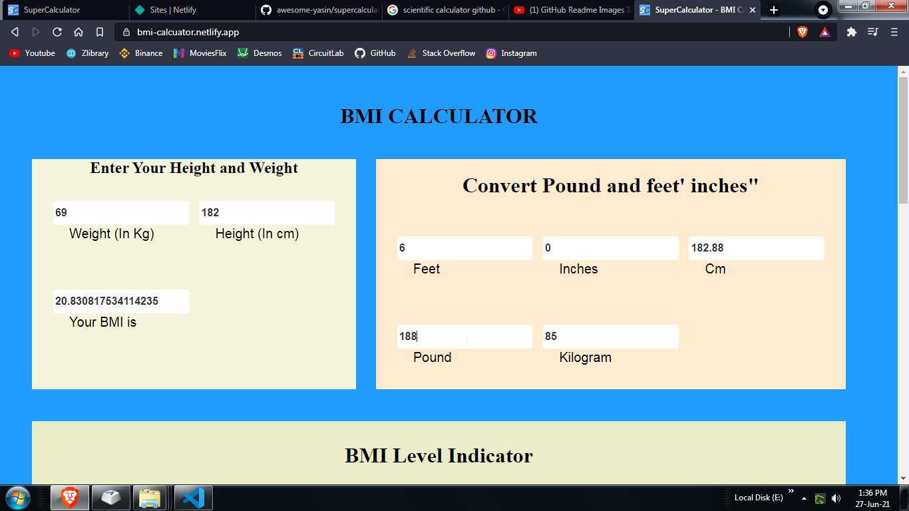 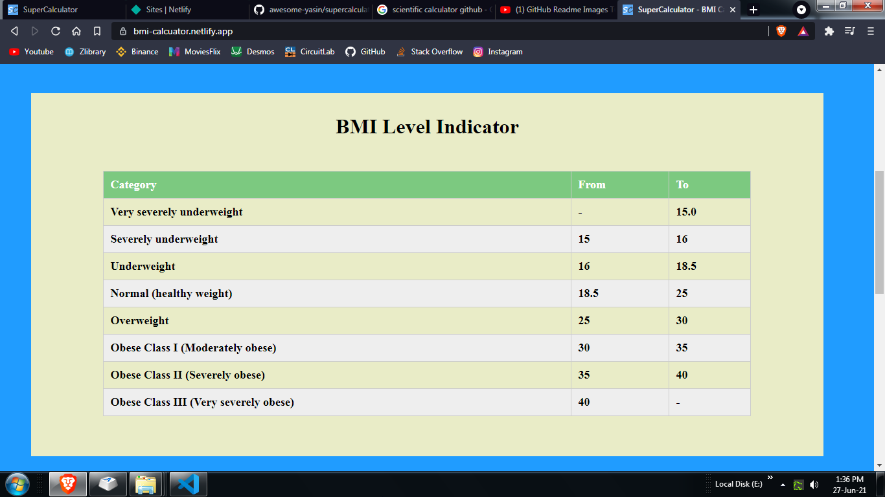 

### Demo: https://bmi-calcuator.netlify.app/

## 17. Ohm's Law Calculator

Simple to use Ohm's Law Calculator. Calculate Power, Current, Voltage or Resistance. Just enter 2 known values and the calculator will solve for the others. All these are made using Pure Javascript.

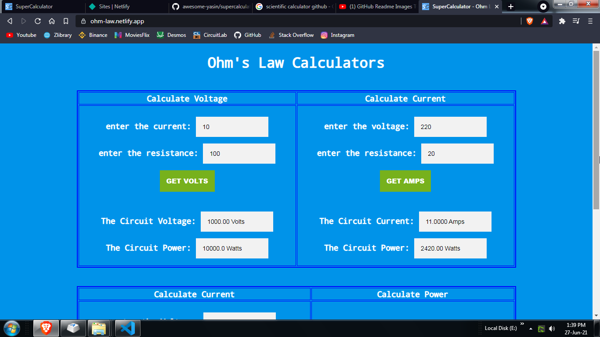 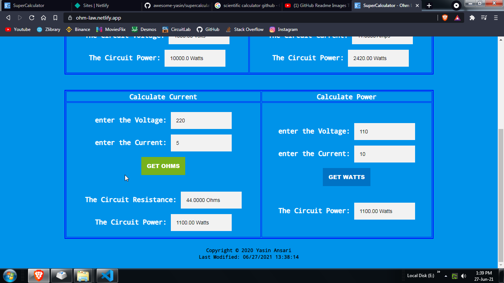

### Demo: https://ohm-law.netlify.app/

## 18. Equivalent Resistance Calculator

This tool was designed to help you quickly calculate equivalent resistance, whether you have two or ten resistors in parallel. Its very helpful calculator and one of the best calculator in the list.

Its also has ample of example of how to use this calculator to simplify complex circuits. You can solve any complex circuits if your approach is right. Its also made in pure Javascript without any library.

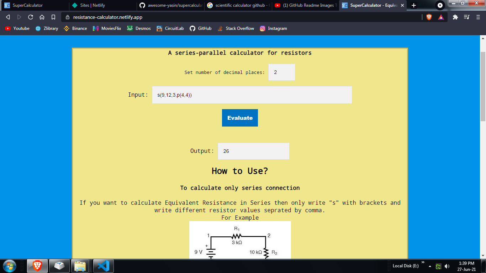 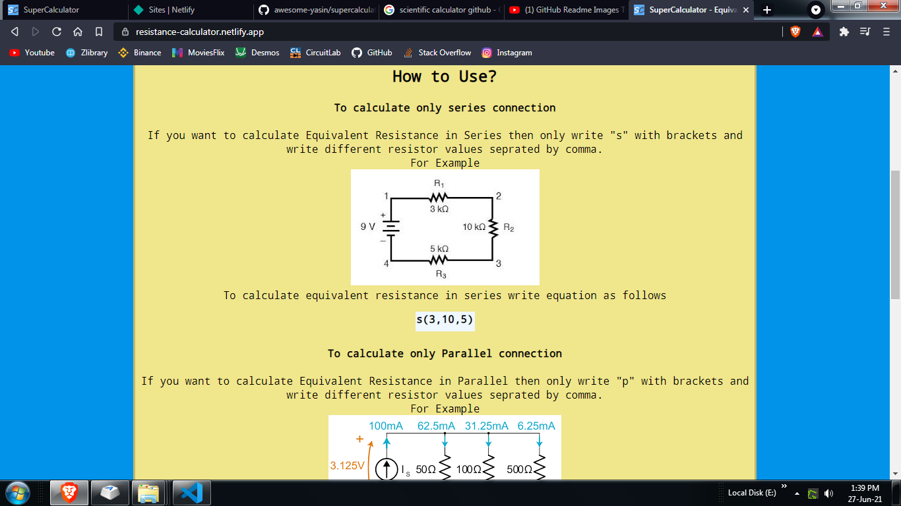

### Demo: https://resistance-calculator.netlify.app/

## 19. Resistor color code calculator

The resistor color code calculator makes it easy to identify and select resistance and tolerance values for 4, 5, and 6 band through hole resistors. 

It has a simple UI and made in pure Javascript just like other calculators.

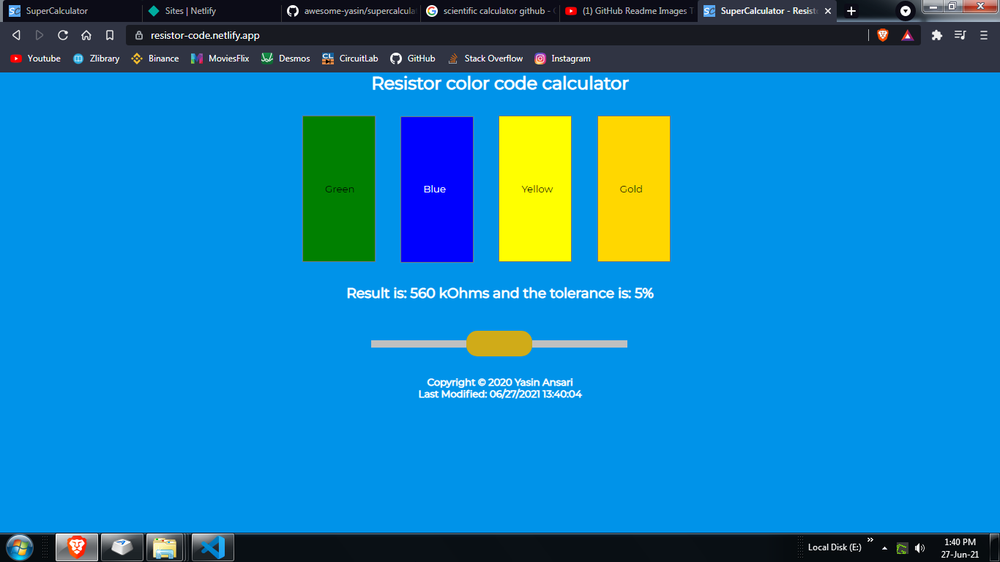

### Demo: https://resistor-code.netlify.app/

##20. 2-D Function Graphing Calculator

Interactive, free online graphing calculator from functions, plot data, drag sliders, and much more. This calculator uses Desmos API to make Graph. Try this calculator to make awesome graphs.

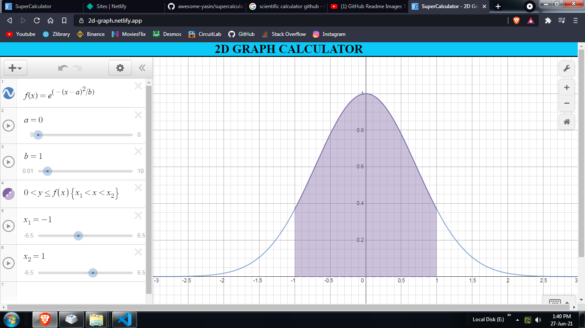

### Demo: https://2d-graph.netlify.app/

## 21. 3-D Function Graphing Calculator

Try this awesome 3-D function grphing calculator to make 3d graphs. Its also contains some pre made 3D functions that have some awesome Graphs. Type the function inside the grapher to see awesome graph in X Y Z directions. It also has Vector, points, Parametric and Vector Fields. Its JS contain thousands of lines of code although its code not belong to me but I've Just shared it. It belong to a github account that was deleted from github after sometime thats why i didnt gave credit to it. It does not support in Mobile Screen. It can only be used in PC.

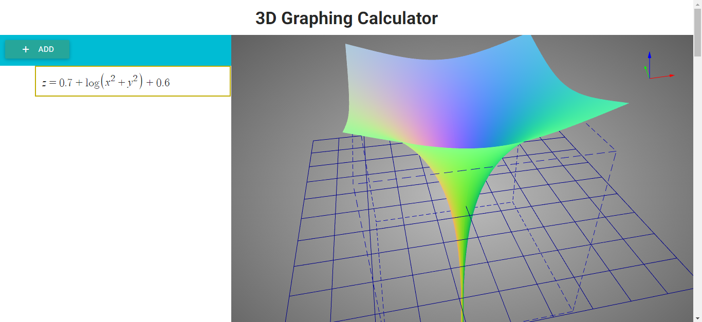

### Demo: https://3d-grapher.netlify.app/

# Technologies Used:

To make it beginner friendly Ive only used:

1. HTML
2. CSS
3. Javascript
4. Jquery (in only one section)
5. API's

# Contribution

If you want to contribute to this project and make it better with new ideas, your pull request is very welcomed. If you find any issue just put it in the repository issue section, thank you.
